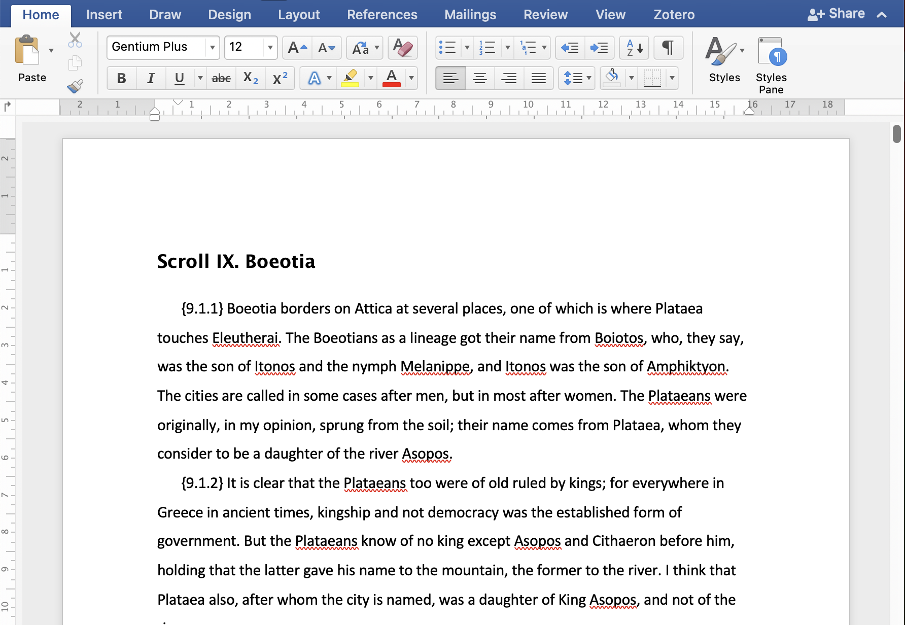

## The State of the Problem

    
    

<aside class="notes">
I want to start by thanking the Ancient Makerspaces group for organizing these panels and for being flexible with presentation formats. And thank you all for coming to yet another virtual talk --- I regret not being able to make it to the SCS this year, but the early-career academic life has taken me to Switzerland for this year, and a weekend jaunt to Chicago is just not in the cards.

Microsoft Word is still the de facto standard for drafting articles for publication in the humanities. It is a handy tool, and although
it now uses the Office Open XML (or "OOXML") standard, it is not easy to disseminate the textual information contained therein without
sending around a file that just so happens only to open properly in this paid program.

In this talk, I want to discuss the challenges presented by this format for building the Open Commentaries platform, a web application
meant to power open and accessible commentaries on a range of ancient texts.

This talk won't just be about Microsoft Word and its underlying format, but will rather be a provocation for us to think differently
about what a text is and what textual data means to convey. I hope that by sharing some of the ways in which my own intuitions about
text have been challenged, we can start to discuss some of the broader --- and seemingly more intractible --- challenges posed
by the genre of commentary more generally.
</aside>

---
### OOXML

<pre><code data-trim data-noescape></code></pre>

---
## About Me

    
🤓

    
🥸

    
🏺

    
📙

<aside class="notes">
I am a reluctant software engineer. I took a break from the study of literature and somehow ended up working at a few
startups in the 2010s before returning to get a PhD in Classics. My engineering background is mainly in web development,
where we took for granted that "text" was just things that users wrote in boxes --- maybe in Markdown if we felt
like parsing it.
</aside>

---
## Open Commentaries

<aside class="notes">
Since 2017, I've been involved with the New Alexandria Foundation as a developer on text-based platforms like
Open Commentaries. 

We originally based the data model for commentaries on the "blocks and entity map" used by
Facebook's Draft.js. 

A model very similar to this still powers many of the rich text editors on the web, and our using it
in a <em>reading-heavy</em> environment might already be setting off alarm bells in some of your heads.

Why can't we just write and host TEI XML files that contain all of the markup that we need?
</aside>

---
### TEI XML

<pre><code data-trim data-noescape></code></pre>

---
### OOXML

<pre><code data-trim data-noescape></code></pre>

---

<aside class="notes">
I'm over-simplifying, and in actual fact the OOXML representation of a text
provides many of the features we're looking for because it uses multiple files
to handle some of the non-linear features on which commentaries depend. In this
regard, TEI's "one document does it all" --- which, at least with the texts
that I've encountered, appears to have morphed from suggestion to dogma ---
is an encumbrance that makes each document an idiosyncratic collection of
tags and attributes. The relatively small tag vocabulary of OOXML's WordprocessingML package
makes it fairly straightforward to reason about
what kinds of structures one will encounter and enables the kind of interoperability that has, for better or worse, made Word the de facto standard of the humanities.

As an aside, it feels strange that I am effectively defending
Microsoft Word. To be clear, on a personal level, I'm deeply frustrated with the requirement to use an expensive, closed-source, and notoriously buggy program for most of my scholarly writing. I'm sure I'm not the only person in the room who has had a reader return a paper, unread, because it was "too short" thanks to LaTeX's layout algorithm, only to submit the exact same paper as a Word document and receive copious helpful comments because now it was the "proper length" --- when in reality Word just added some unnecessary page breaks and a few styles that will be a pain to catch when submitting the paper for publication.

So in reality, I'm not a fan of Word's grip on the humanities. But when looking at OOXML as a standard --- I don't hate it.
</aside>

---
## Why does this matter?

Commentary is an inherently non-linear form of textual representation.

<aside class="notes">
But back to what I said in passing a moment ago: Commentary is an inherently non-linear form of textual representation, and TEI XML struggles to represent non-linear structures. Some digital humanists have tried to solve this problem through various implementations of stand-off markup. Pose et al. in 2014 introduced three new elements suited to this purpose, effectively growing the already gargantuan TEI specification.
</aside>

---
## Why does this matter?

<caption><small>Randall Munroe. "Standards." <em>XKCD</em> 927. https://xkcd.com/927/.</small></caption>

<aside class="notes">
In practice, TEI XML gets around this infamous XKCD problem by being blackhole standard that appears to consume every idea one can throw at it. Hence the rise of competing standards like EpiDoc that attempt to carve off a subset of the TEI spec for their own use.

This situation gives rise to what Desmond Schmidt has called the "TEI Paradox," namely that 
</aside>

---
## Why does this matter?

    <blockquote>
    Valid XML data can be loaded unmodified into such applications and can be successfully parsed, merged, edited, searched, and transformed. But in spite of these properties of XML itself, information encoded at the TEI level, at the “tag” level, is mostly not interoperable.
    </blockquote>
    Schmidt 2014: 12

<aside class="notes">
"Valid XML data can be loaded unmodified into such applications and can be successfully parsed, merged, edited, searched, and transformed. But in spite of these properties of XML itself, information encoded at the TEI level, at the “tag” level, is mostly not interoperable." (Schmidt 2014: ¶ 12)

As digital humanists, it is the meaning of the tag that matters, or at least that's what our intuitions suggest. TEI tags represent literally thousands of years of textual criticism and emendation, distilled into a few bytes of code-y looking thingamajigs whose information has nevertheless not been formalized in the ways that we demand from programming code.
</aside>

---
## Why does this matter?

    <ol>
        <li>a title tag inserted by the transcriber of a physical document as an interpretation of what he/she sees (but it may not be true), and</li>
        <li>the same tag used by an author to declare that his/her digital text is in fact a title.</li>
    </ol>
    
Schmidt 2014: ¶¶ 12–13, citing Renear 2000.

<aside class="notes">
Alan Renear, quoted by Schmidt, sums up the problem as one of "mood": depending on the author's disposition, a "title" tag can represent the ultimately affective and aesthetic interpretation of a document or --- perhaps better --- the element's function within some kind of abstract document.

With TEI, we often think we're doing the latter when really we're doing the former.
</aside>

---
## Why does this matter?

 
    
    <caption><small>Venetus A F 24 recto [Marcianus Graecus Z. 454 (=822)] via Wikimedia Foundation</small></caption>

<aside class="notes">
So not only do we tie ourselves in knots with our acts of angle-bracketed interpretation, but we also --- as I have kind of done here --- lose track of our original goal because we had so much XML cleanup to do. The process of modifying a TEI document, like the process of commentary itself, is inherently nonlinear.

We can see evidence
of this fact just by taking a glance at the Venetus A manuscript of Homer's <em>Iliad</em>,
where the layers of scholia and interlinear gloss and emendation have accrued over time.
</aside>

---
## Why does this matter?

    <blockquote class="fragment">
        "In the final analysis, strongly embedded markup causes the possibly non-linear form of the data content to collapse upon the exclusively linear form of the data expression. The linearization of the <em>expression</em> cannot, however, bring about the linearization of the content and its structure."
    </blockquote>
    Buzzetti 2002: 73

<aside class="notes">
But XML, regardless of its specification, is built to define linear data. As Dino Buzzetti
has argued, "In the final analysis, strongly embedded markup causes the possibly non-linear form of the data content to collapse upon the exclusively linear form of the data expression. The linearization of the _expression_ cannot, however, bring about the linearization of the content and its structure." (73)
</aside>

---
## Adding commentary to a text

<pre><code data-trim data-noescape></code></pre>

<aside class="notes">
When we have this discrepancy between the form of the text and its expression --- to borrow Buzzetti's vocabulary ---
we almost immediately run into problems when modifying the markup to add things like commentary glosses.

We could add them manually, but then the text becomes even more cumbersome for other scholars to consume.
If we try to add them programmatically --- say, by using CTS URNs (more on those in a second) ---
we run into problems because the representation of the text does not match our structure.

Textual elements on which we might want to comment can be nested at arbitrary depths within the document tree,
meaning that every look-up of a lemma is not a simple XPath expression but is rather an XPath expression
followed by a series of test cases to flatten the tree for any number of nodes and then to reassemble the
same tree for representing the new data with annotations at the proper lemmata.
</aside>

---
## Limitations of XPath

<small>#xpath('/div[type="textpart" and subtype='book' and n='9']/div[...]/div[...]/p/???')<small>

<pre><code data-trim data-noescape></code></pre>

<aside class="notes">
Modifying the structure in this way comes with another caveat, namely that the glosses now depend on 
the order in which they are inserted, because each one changes the structure of the underlying XML.
Overlapping glosses --- in the case of a multi-commentary like what we're trying to build with
Pausanias and what I'm currently building for Sophocles' <em>Ajax</em> at UNIL --- become
a nightmare to deal with.
</aside>

---
## Now with OOXML

<pre><code data-trim data-noescape></code></pre>

<aside class="notes">
Now imagine that you've been handed a 750-page translation-in-progress of Pausanias's <em>Periegesis</em> as a Word
document. By its own admission, TEI XML provides few guiderails, but it at least seeks to describe
the structure of the document, where OOXML strives mainly to describe how the document <em>looks</em>.

So now not only do we have arbitrarily nested lemmata, we also have no pre-defined way of getting
to them. Each look-up operation becomes a precarious and error-prone tree traversal through
a labyrinth of tags, IDs, and attributes.

This is another confusion of form and representation enabled by angle brackets, and it makes it even more
difficult to traverse the document tree and add annotations in a sustainable, scalable way.
</aside>

---
## Stand off and Mark up

    
    

        <caption><small>Schmidt 2014: ¶ 30 Figure 1</small></caption>
    

<aside class="notes">
So we have an interoperability problem, where a text encoded by one scholar can't be used without modification by another scholar, and we need to implement a stand-off editor like the one described by
Desmond Schmidt in 2014. Let's take a second to appreciate
what Schmidt has sketched out in this diagram.

We have multiple versions of the text, but only one of them can be edited at a time. (¶ 30) Other standoff markup sets are also fed into the formatter.

Schmidt (2014: ¶ 36) makes some vague suggestions for how we could store the annotations in the markup sets, reaching the important conclusion that "\[A\]nnotation should point to the document, not the other way around."

In ¶ 37, he argues that stripping markup from TEI-encoded texts is "far more trouble than five minutes' work," and he does a commendable job of showing how the problem is not just stripping the markup but keeping track of all of the various meanings encoded in that markup which invariably affect the underlying texts --- plural! --- that dwell therein.

So some vague notion of text version and markup sets are fed into
the formatter, which performs its Eldritch magic to present the user with Markdown or XML that a browser knows how to turn into a WYSIWYG interface.

The user can edit the text via this interface, and then on save pass the edited XML back to the stripper, which re-converts the text into a version and its accompanying stand-off markup sets.
</aside>

---
## Stand-off Editors in Practice

    
    <small>https://homer.oc.newalexandria.info/read/urn:cts:greekLit:tlg0012.tlg001.perseus-grc2:1.1-1.30</small>

<aside class="notes">
In the first version of Open Commentaries, this is exactly what
we did, allowing users to edit their own comments, translations, and even versions of a text. (I demoed this functionality at SCS 2021.)

You can see still see the fruits of these efforts, but there are some important caveats. Writing a text editor is a non-trivial affair, and writing a *multi*-text editor is just asking for trouble.

This system makes it really difficult to map translations to editions and their annotations, in part because the whole graph is dynamic: users can effectively add nodes at will, and the application needs to figure out where all of the annotations now belong in the new graph.
</aside>

---
## Stand-off Editors in Practice

    
    <caption><small>Persephone supervising Sisyphus in the Underworld, Attic black-figure amphora, c. 530 BC, Staatliche Antikensammlungen, via the Wikimedia Foundation.</small></caption>

<aside class="notes">
And that 750-page Word file I mentioned earlier? Its comments were painstakingly copied into the bespoke WYSIWYG editor by hand.

And if an annotation changes, it needs to be found and revised in the WYSIWYG editor again.

Sisyphus would be proud.
</aside>

---
## Pandoc to the rescue

    
    <caption>pandoc.org</caption>

<aside class="notes">
I know that this has been a lot of lead-up, but I think it's important for understanding the scope of the problem. In the current version of Open Commentaries, we're using Pandoc to parse those enormous Word documents and manipulate them directly.
</aside>

---
## Pandoc to the rescue

<pre><code data-trim data-noescape></code></pre>

<aside class="notes">
Pandoc (here called via the Elixir library Panpipe) parses the document into an abstract syntax tree with a relatively small number of possible nodes.

We then flatten these "fragments" (sub-trees) and tag them using a tuple that contains the information needed for parsing them as stand-off markup.
</aside>

---
## Pandoc to the rescue

<pre><code data-trim data-noescape></code></pre>

<aside class="notes">
As an aside, Elixir's pattern matching lets us write
these relatively small functions for the reducer that
runs over the document and flattens it into plain-text
and stand-off markup lists. 
</aside>

---
## Pandoc to the rescue

<pre><code data-trim data-noescape></code></pre>

<aside class="notes">
Tagging elements is just a matter of flattening their containing
string and marking their start and/or end offsets.
</aside>

---
## Pandoc to the rescue
<pre><code data-trim data-noescape></code></pre>

<aside class="notes">
Processing the entire document as stand-off markup and text lets us do things like use a BERT for token classification and eventually named-entity recognition. And we can store the resulting tags in the same way that we've stored every other element of markup.
</aside>

---
## APRIP

    
    
    
    

<aside class="notes">
The result looks something like this. Images are handled like any other element of markup: we store the data about the image and its location within the text as a pointer to a CTS URN, backed by a foreign key relation between the element and the text node that contains it.

2. We can click on a text container --- basically, a canonical reference, so 1.1.1 in the Periegesis in this case --- and pull up a list of comparanda for selection.

3. Choosing a comparandum displays it next to the text node that it modifies.

4. We can even include comments about comments with the same
kind of referential integrity. Adding these comments automatically would create all sorts of headaches if done directly on the underlying XML, but by pre-converting it to stand-off mark-up and then exporting it in a format that the browser understands, we achieve these results with relative ease.
</aside>

---
## AjMC

    
    
    

<aside class="notes">
We've taken a slightly different tack with the Ajax Multi-Commentary Project, althought it uses the same underlying tech stack and algorithms.

2. Each comment can be expanded to show its OCR-generated text. (You'll probably notice some issues --- this is a preview that's not yet available for public consumption.)

3. And we can use the IIIF API to highlight the region of the text in a scan of the document.
</aside>

---
## Conclusions

<aside class="notes">
So what conclusions can we draw from this bit of XML spelunking?

First, as I hinted above, I don't think we should be so quick to dismiss standards with relatively small vocabularies. TEI's kitchen-sink approach is slowing us down, and we need to consider approaches that help us shrink the problem space to achieve the interoperability that we're after.

Second, text is far from simple. As I said in my SCS talk a few years ago, we _are_ effectively dealing with linked lists of text nodes, but when we start indexing into those lists from other lists --- for example, when we start building a commentary --- we quickly enter graph territory, as Elli Bleeker et al. describe in their 2021 paper on the Text-as-Graph model and as Corinna Coupette et al. show in their paper from last year.

We should not be so quick to dismiss these kinds of textual manipulations as "simple."

Finally, we do not need to avoid commercial tools like Microsoft Word --- indeed, they will remain unavoidable for the foreseeable future. By embracing these tools and their models, we can gain deeper insights into what a text actually is in 2024 and how we can use and study them to gleen and share new insights into the information that they contain.
</aside>

---
## Bibliography

<ul>
    <li>Bleeker, Elli, Ronald Haentjens Dekker, and Bram Buitendijk. 2021. “Texts as Hypergraphs: An Intuitive Representation of Interpretations of Text.” Journal of the Text Encoding Initiative, no. Issue 14 (March). https://doi.org/10.4000/jtei.3919.</li>
    <li>Buzzetti, Dino. 2002. “Digital Representation and the Text Model.” New Literary History 33 (1): 61–88. https://doi.org/10.1353/nlh.2002.0003.</li>
    <li>Coupette, Corinna, Jilles Vreeken, and Bastian Rieck. 2023. “All the World’s a (Hyper)Graph: A Data Drama.” Digital Scholarship in the Humanities, November, fqad071. https://doi.org/10.1093/llc/fqad071.</li>
</ul>

---
## Bibliography

<ul>
    <li>“Ecma Office Open XML Part 1 - Fundamentals And Markup Language Reference.” 2016. https://ecma-international.org/publications-and-standards/standards/ecma-376/.</li>
    <li>Pose, Javier, Patrice Lopez, and Laurent Romary. 2014. “A Generic Formalism for Encoding Stand-off Annotations in TEI.” HAL.</li>
    <li>Schmidt, Desmond. 2014. “Towards an Interoperable Digital Scholarly Edition.” Journal of the Text Encoding Initiative, no. 7 (November). https://doi.org/10.4000/jtei.979.</li>
</ul>

---
## Bibliography

<ul>
    <li>Spadini, Elena, and Magdalena Turska. 2019. “XML-TEI Stand-off Markup: One Step Beyond.” Digital Philology: A Journal of Medieval Cultures 8 (2): 225–39. https://doi.org/10.1353/dph.2019.0025.</li>
</ul>

---
## Additional bibliography

<ul>
    <li>Herrmann, J Berenike. 2023. “Tool Criticism in Practice. On Methods, Tools and Aims of Computational Literary Studies.” Digital Humanities Quarterly 17 (2).</li>
</ul>